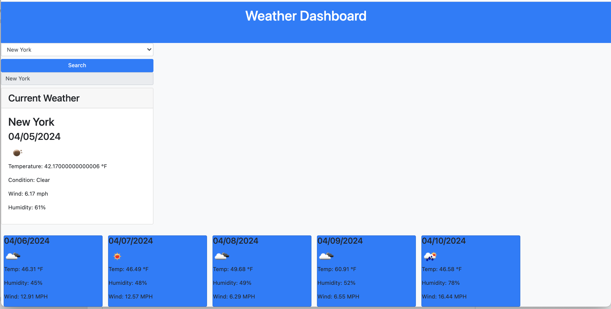

# Weather-Dashboard-Challenge
User Story

AS A traveler
I WANT to see the weather outlook for multiple cities
SO THAT I can plan a trip accordingly
Acceptance Criteria

GIVEN a weather dashboard with form inputs
WHEN I search for a city
THEN I am presented with current and future conditions for that city and that city is added to the search history
WHEN I view current weather conditions for that city
THEN I am presented with the city name, the date, an icon representation of weather conditions, the temperature, the humidity, and the wind speed
WHEN I view future weather conditions for that city
THEN I am presented with a 5-day forecast that displays the date, an icon representation of weather conditions, the temperature, the wind speed, and the humidity
WHEN I click on a city in the search history
THEN I am again presented with current and future conditions for that city

Solutions:
I added Two API's to get the current weather and the second API key to get the 5 day weather forecast displayed for the same city. It interacts with the OpenWeather API to fetch weather data based on user input.
Functions are implemented to process the retrieved data and update the HTML content accordingly.
Event listeners are used to respond to user actions such as city searches and clicks on recent search history.
